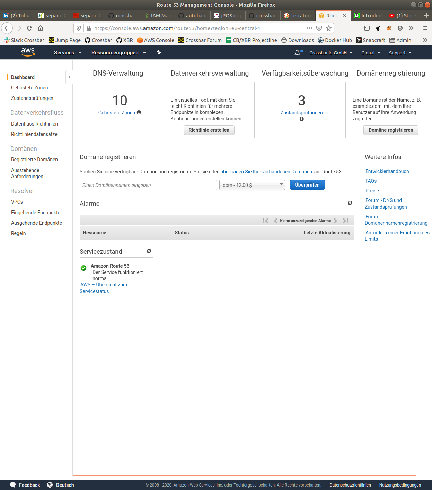
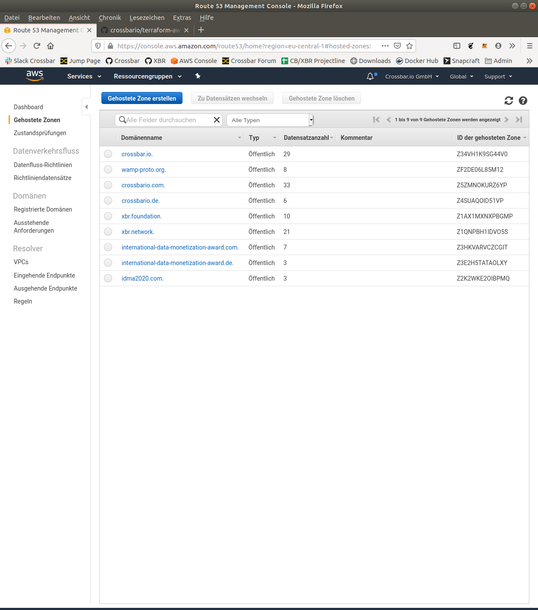
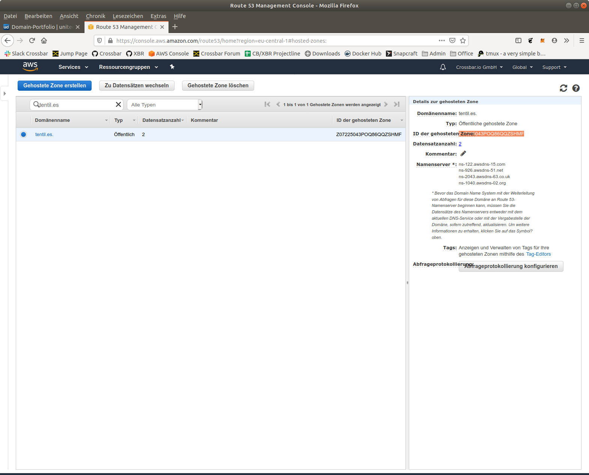
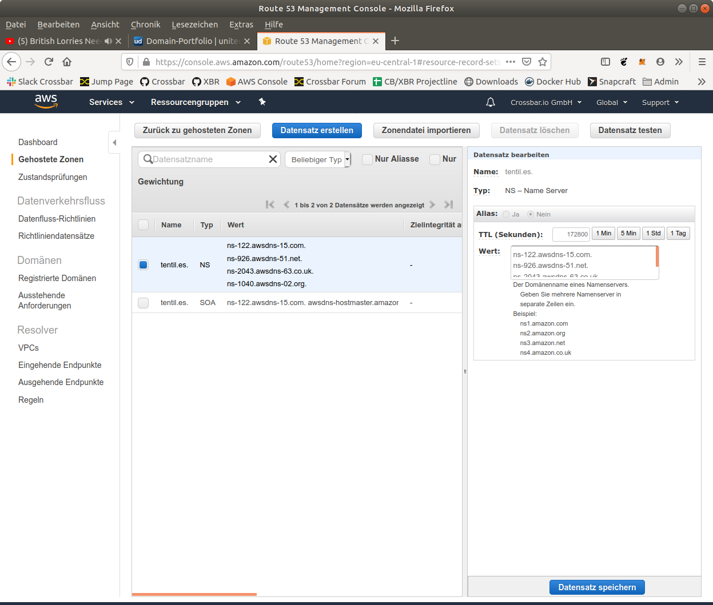

# Crossbar.io FX Cloud

[](https://registry.terraform.io/modules/crossbario/crossbar)

This project provides a [Terraform module](https://www.terraform.io/docs/configuration/modules.html) that can create Crossbar.io FX based clusters and cloud deployments in AWS.
The module is [open-source](LICENSE), based on the [Terraform Provider for AWS](https://terraform.io/docs/providers/aws/index.html) and
[published](https://registry.terraform.io/modules/crossbario/crossbarfx)
to the [Terraform Registry](https://registry.terraform.io/).

## How it works

Crossbar.io FX Cloud is a complete cloud setup with a Crossbar.io FX cluster which provides:

* clustered WAMP application routing
* remote cluster management and monitoring
* static Web content hosting and other Web services
* optional HTTP/REST-to-WAMP and MQTT-to-WAMP bridges
* optional XBR data market

Crossbar.io FX Cloud uses Terraform to automate the deployment of all cloud resources required for
an auto-scaling enabled Crossbar.io FX cluster in AWS:

* an AWS VPC spanning three AZs with three Subnets (one in each AZ)
* an AWS NLB (Network Load Balancer), spanning all AZs
* an AWS Route 53 Zone (DNS) pointing to the NLB
* AWS EFS shared filesystems, spanning all AZs
* an AWS EC2 instance for the CrossbarFX master node
* an AWS Auto-scaling group of AWS EC2 instances for the CrossbarFX edge/core nodes

The cluster auto-scaling group will have an initial size of two, which together with the master node results in a **total of three AWS EC2 instances started** by default. The edge/core nodes will be automatically paired with the (default) management realm.

### Here is what you get

The whole Crossbar.io FX Cloud is deployed into an AWS region of choice, and everything (most) is setup within a dedicated VPC newly created.

Static Web content for the cloud will be accessible at

* [https://example.com/](https://example.com/)
* [https://web.example.com/](https://web.example.com/)

The contents is served from AWS Cloudfront, a CDN more than a hundred PoPs globally. The CDN content is seeded from
a S3 bucket, so publishing the web site amounts to uploading new content to the S3 bucket. The Web content will be
super-scaled and DDoS protected. Web access logs are automatically stored in a dedicated S3 bucket.

The AWS Cloudfront TLS settings are hardened, and TLS certificates for Cloudfront are managed and automatically refreshed using AWS ACM.

The master node can be accessed at

* [http://master.example.com:9000/](http://master.example.com:9000/)

> TODO: move master to TLS(-only) and manage via ACM

The routing cluster can be accessed at

* [https://data.example.com/](https://data.example.com/)

This is resolved using AWS Route 53 to a AWS network load balancer in the region the cloud is deployed to

* [http://crossbar-nlb-617ab2c4306439b6.elb.eu-central-1.amazonaws.com/](http://crossbar-nlb-617ab2c4306439b6.elb.eu-central-1.amazonaws.com/)

The AWS NLB has a load-balancer node in every availability zone within the respective region. The load-balancer nodes in turn
forward TCP traffic (at OSI layer 4, and cross-(availability-)zones) to one of the (healthy) cluster nodes

* [http://ec2-3-121-227-127.eu-central-1.compute.amazonaws.com:8080/](http://ec2-3-121-227-127.eu-central-1.compute.amazonaws.com:8080/)

The AWS NLB TLS settings are hardened, and TLS certificates for the NLB are managed and automatically refreshed using AWS ACM.

## How to use

The following describes how to create a new *Crossbar.io FX Cloud* to host a domain (or subdomain) you control.

1. Prerequisites
2. Create AWS Zone
3. Configure DNS Domain
4. Initialize repository
5. Import AWS Zone
6. Deploy cloud setup

### Prerequisites

You will need the following to create a *Crossbar.io FX Cloud*:

1. GitHub account
1. AWS account
1. own DNS domain
1. Terraform CLI

**DNS Domain**

You will need a DNS domain (or subdomain) under your control for your *Terraform for Crossbar.io FX*
cloud. "Control" here means that you must be able to configure the authorative DNS nameservers
for your domain, usually using a user interface provided by your DNS registrar.

> Note: you MUST be able to configure DNS NS entries for nameservers in your domain. The entries
will need to point to AWS nameservers specific to the AWS Route 53 zone you create.

**AWS Account**

You can use your personal AWS account for running Terraform, but using an IAM user specifically
created for Terraform automation access is preferred for production.

An IAM user for Terraform with quite broad permissions to get you started easily in development
should have the following permissions:

* IAMFullAccess
* AmazonEC2FullAccess
* AutoScalingFullAccess
* ElasticLoadBalancingFullAccess
* AmazonS3FullAccess
* CloudFrontFullAccess
* AmazonVPCFullAccess
* AmazonElasticFileSystemFullAccess
* AmazonSNSFullAccess
* AmazonRoute53FullAccess
* AWSCertificateManagerFullAccess

This will allow Terraform to create and manage AWS cloud resources required for *Crossbar.io FX Cloud*.

**Terraform**

For Terraform, you can use either the [Terraform command-line tool (CLI)](https://www.terraform.io/downloads.html)
or use your account on [Terraform cloud](https://app.terraform.io/).

When using the Terraform CLI

```console
$ which terraform
/usr/local/bin/terraform
$ terraform --version
Terraform v0.12.28
```

the actual AWS resources currently running and (local) desired Terraform configuration (and local state files) are compared,
and necessary actions on AWS are taken by calling into the AWS API using the IAM user configured locally.

The IAM user can be set via environment variables

```console
export AWS_ACCESS_KEY_ID="AKIA..."
export AWS_SECRET_ACCESS_KEY="yXbT..."
export AWS_DEFAULT_REGION="eu-central-1"
```

or configuration

```console
$ cat ~/.aws/credentials
[default]
aws_access_key_id = AKIA...
aws_secret_access_key = yXbT...
aws_default_region = eu-central-1
```

See [here](https://www.terraform.io/docs/providers/aws/index.html) for further information.

When using Terraform cloud, the desired Terraform configuration must be versioned in a GitHub repository, and state is
stored in Terraform cloud. In this case, the AWS IAM user to be used must be configured in Terraform cloud.


### Create AWS Zone

Before you can start automated deployment of your new Crossbar.io FX Cloud, you need to create a *hosted zone*
in AWS Route53 and configure your domain to use the AWS nameservers specific to the zone.

In your web browser, sign in to the AWS Management Console.
From the Services menu, navigate to Route 53 dashboard:



Go to the view of your Hosted Zones:



Add a new hosted zone for the domain name you want to configure:



Note the Zone ID (eg `Z2ABCDABCDABCD`) and AWS DNS nameservers (the four hostnames in the NS record of the zone):



### Configure DNS Domain

Before continuing, register the AWS name servers for your Route 53 zone with the registrar of your domain name.

When a new Hosted Zone is created, Route 53 automatically generates the obligatory SOA entry as well as an NS record with four name servers supplied by AWS, e.g.


```
ns-122.awsdns-15.com
ns-926.awsdns-51.net
ns-2043.awsdns-63.co.uk
ns-1040.awsdns-02.org
```

Make sure that these four name servers are registered as authoritative name servers for your domain with the registrar of your domain (this is the company whose service you used to register your domain name).


After configuration, the new nameservers need to propagate the DNS system.
Once that has happened (which may take several minutes to half an hour), resolving your domain should return all four AWS nameservers for your zone.

To [test nameservers using dig](https://support.rackspace.com/how-to/using-dig-to-query-nameservers/):

#### Test domain nameservers

To test to which nameservers your domain resolves to (here, using `8.8.8.8` (Google) as DNS provider for the resolution):

```console
dig @8.8.8.8 +short NS yourdomain.xyz
```

**IMPORTANT: You must wait before continuing until you can verify the correct nameservers. This can take several minutes or even an hour or longer after you modified nameservers at your registrar for DNS to replicate.**

> Instead of `8.8.8.8`, you also can first test using one of the four AWS nameservers for your
zone. All four nameservers should be returned immediately after creating the zone. Other nameservers will only return the same list once the DNS information has been propagated.

### Initialize repository

All configuration for your *Crossbar.io FX Cloud* is done from a dedicated GitHub repository used for this cloud setup.

Create and clone a new GitHub repository, and create a single file **main.tf** (in the root of this repository) with this contents:

```terraform
module "crossbar" {
    source  = "crossbario/crossbar/aws"
    version = "1.5.2"

    aws-region = "eu-central-1"
    admin-pubkey = "ssh-key.pub"

    dns-domain-name = "yourdomain.xyz"

    domain-web-bucket = "yourdomain.xyz-web"
    domain-weblog-bucket = "yourdomain.xyz-weblog"
    domain-download-bucket = "yourdomain.xyz-download"
    domain-backup-bucket = "yourdomain.xyz-backup"
}
```

Adjust the AWS region desired, and the file path to your public SSH key. Replace `yourdomain.xyz` with your desired (sub-)domain name.

Then, initialize Terraform:

```console
terraform init
```

### Import AWS Zone

Now import the AWS zone **YOURDOMAIN-XYZ-ZONE-ID** you previously created (manually):

```console
terraform import module.crossbar.aws_route53_zone.crossbar-zone YOURDOMAIN-XYZ-ZONE-ID
```

**IMPORTANT: make sure to _first_ import the (manually created) zone to Terraform, before running `terraform apply`. Otherwise a new zone will be created with new nameservers - which you wouldn't have configured at your registrar yet (and consequently DNS verification records for e.g. TLS certificate validation will fail as your domain doesn't resolve to the correct zone)**

### Deploy cloud setup

Finally, to automatically deploy and configure everything in AWS:

```console
terraform plan
terraform apply
```

#### Deploy a cluster from Terraform Cloud

If you have an account at [Terraform Cloud](https://app.terraform.io), you can also
(as an alternative to the pure CLI approach described above) create a new workspace
and deploy from there:

```console
...
Apply complete! Resources: 0 added, 0 changed, 0 destroyed.

Outputs:

application-url = wss://data.example.com/ws
management-url = ws://master.example.com:9000/ws
master-node = master.example.com
web-url = https://example.com
```


#### Use the CLI together with Terraform Cloud

To access and use the state stored remotely in your Terraform Cloud workspace,
and the following to `main.tf`, adjusting for your **organization** and **workspace**:

```console
terraform {
  backend "remote" {
    hostname = "app.terraform.io"
    organization = "crossbario"
    workspaces {
      name = "xbr-network"
    }
  }
}
```

Also see the documentation [here](https://www.terraform.io/docs/cloud/migrate/index.html) on how to migrate from local to cloud hosted Terraform state.

## Packer

The Terraform based setup on AWS is based on AMIs which come with Docker and Crossbar.io FX preinstalled.

We use [HashiCorp Packer](https://www.packer.io/) to bake AMI images directly from our Crossbar.io FX Docker images.

The AMI is build according to the packaging file [crossbarfx-ami.json](crossbarfx-ami.json). To rebuild and
publish AMI images after a new Crossbar.io FX Docker image has been published, run:

```console
make build
```

Note the AMI ID printed, and update [root/variables.tf](root/variables.tf) accordingly, eg

* CrossbarFX 20.6.2: **ami-06ca2353bcdf3ac29**

Here is the log for above:

```console
oberstet@intel-nuci7:~/scm/crossbario/crossbario-devops/terraform$ make build
...
==> amazon-ebs: Digest: sha256:32b6329873e0a755121e18f7757874de24d4a557108cf4d1b36903a7cae669ad
==> amazon-ebs: Status: Downloaded newer image for crossbario/crossbarfx:pypy-slim-amd64
    amazon-ebs:
    amazon-ebs:     :::::::::::::::::
    amazon-ebs:           :::::          _____                 __              _____  __
    amazon-ebs:     :::::   :   :::::   / ___/______  ___ ___ / /  ___ _____  / __/ |/_/
    amazon-ebs:     :::::::   :::::::  / /__/ __/ _ \(_-<(_-</ _ \/ _ `/ __/ / _/_>  <
    amazon-ebs:     :::::   :   :::::  \___/_/  \___/___/___/_.__/\_,_/_/   /_/ /_/|_|
    amazon-ebs:           :::::
    amazon-ebs:     :::::::::::::::::   Crossbar.io FX v20.6.2 [00000]
    amazon-ebs:
    amazon-ebs:     Copyright (c) 2013-2020 Crossbar.io Technologies GmbH. All rights reserved.
    amazon-ebs:
    amazon-ebs:  Crossbar.io        : 20.6.2
    amazon-ebs:    txaio            : 20.4.1
    amazon-ebs:    Autobahn         : 20.6.2
    amazon-ebs:      UTF8 Validator : autobahn
    amazon-ebs:      XOR Masker     : autobahn
    amazon-ebs:      JSON Codec     : stdlib
    amazon-ebs:      MsgPack Codec  : umsgpack-2.6.0
    amazon-ebs:      CBOR Codec     : cbor-1.0.0
    amazon-ebs:      UBJSON Codec   : ubjson-0.16.1
    amazon-ebs:      FlatBuffers    : flatbuffers-1.12
    amazon-ebs:    Twisted          : 20.3.0-EPollReactor
    amazon-ebs:    LMDB             : 0.98/lmdb-0.9.22
    amazon-ebs:    Python           : 3.6.9/PyPy-7.3.0
    amazon-ebs:  CrossbarFX         : 20.6.2
    amazon-ebs:    NumPy            : 1.15.4
    amazon-ebs:    zLMDB            : 20.4.1
    amazon-ebs:  Frozen executable  : no
    amazon-ebs:  Operating system   : Linux-5.3.0-1023-aws-x86_64-with-debian-9.11
    amazon-ebs:  Host machine       : x86_64
    amazon-ebs:  Release key        : RWQHer9KKmNsqP057xopw37DfYE8pl92aOWU5E+OWdhlwtCns7nlKjpE
    amazon-ebs:
==> amazon-ebs: Stopping the source instance...
    amazon-ebs: Stopping instance
==> amazon-ebs: Waiting for the instance to stop...
==> amazon-ebs: Creating AMI crossbarfx-ami-1593617540 from instance i-05911e29903bfff0a
    amazon-ebs: AMI: ami-06ca2353bcdf3ac29
==> amazon-ebs: Waiting for AMI to become ready...
==> amazon-ebs: Terminating the source AWS instance...
==> amazon-ebs: Cleaning up any extra volumes...
==> amazon-ebs: No volumes to clean up, skipping
==> amazon-ebs: Deleting temporary security group...
==> amazon-ebs: Deleting temporary keypair...
Build 'amazon-ebs' finished.

==> Builds finished. The artifacts of successful builds are:
--> amazon-ebs: AMIs were created:
eu-central-1: ami-06ca2353bcdf3ac29

(cpy382_1) oberstet@intel-nuci7:~/scm/crossbario/crossbario-devops/terraform$
```


## Notes

### Handling "Conflicting conditional operation" errors

Should you run into an error similar to

> Error: Error putting S3 policy: OperationAborted: A conflicting conditional operation is currently in progress against this resource. Please try again.

just try again - and again;) Ultimately this is related to eventual consistency of certain AWS resources.

Also see [here](https://stackoverflow.com/questions/13898057/aws-error-message-a-conflicting-conditional-operation-is-currently-in-progress#16553056).
